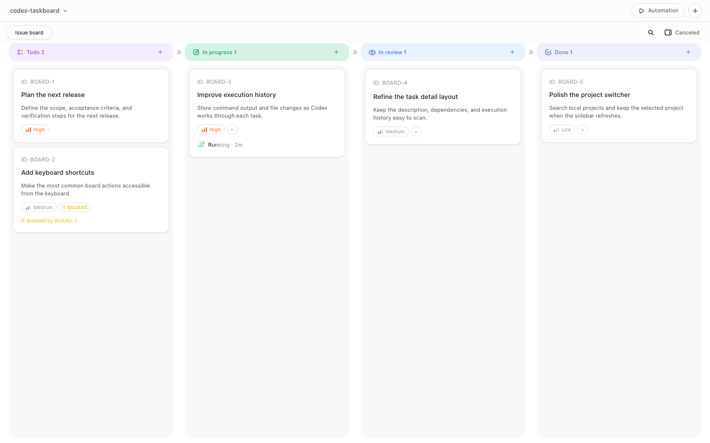
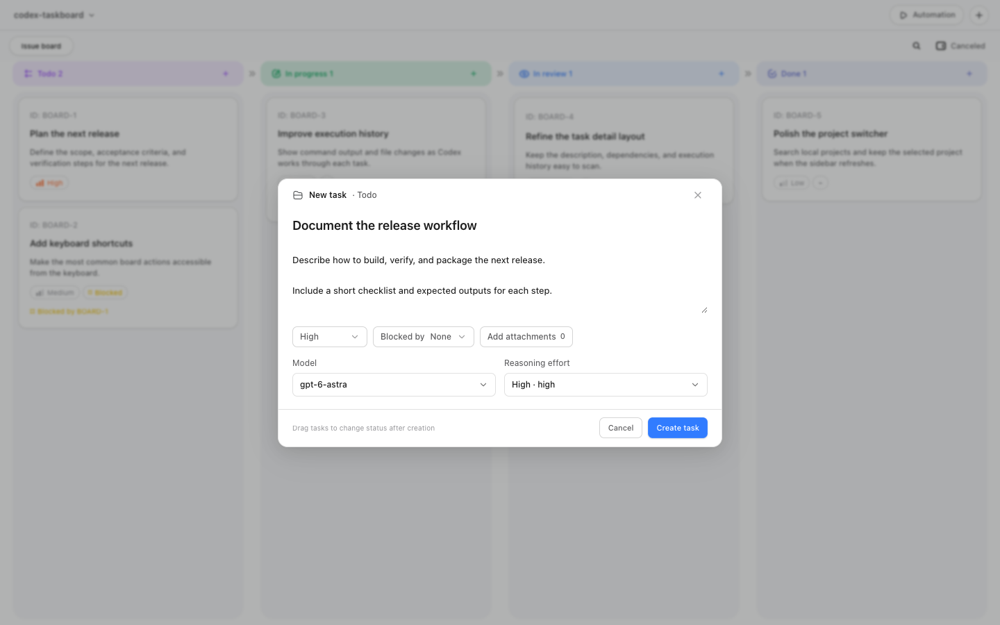
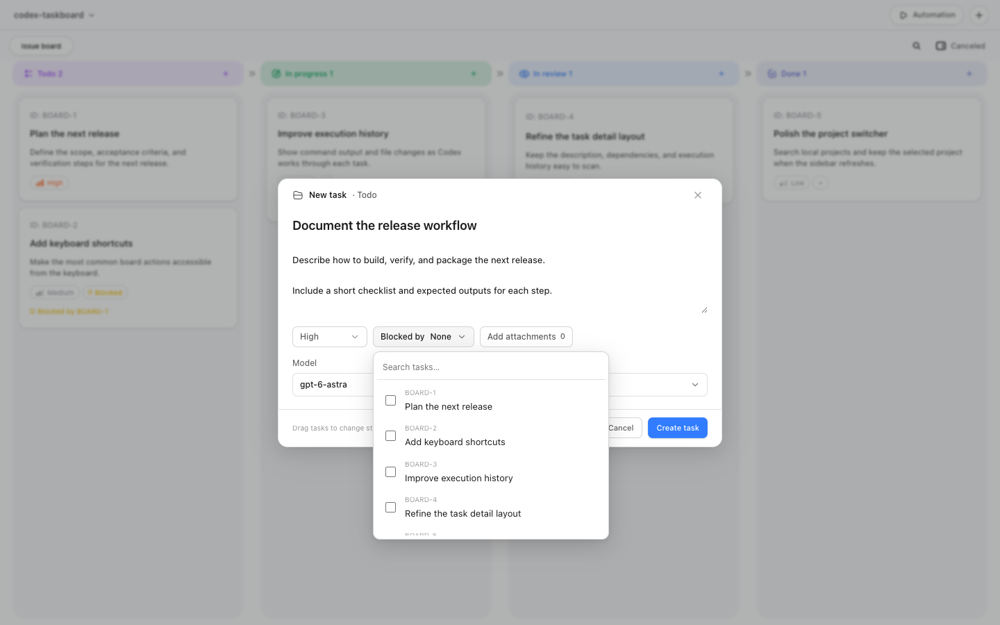
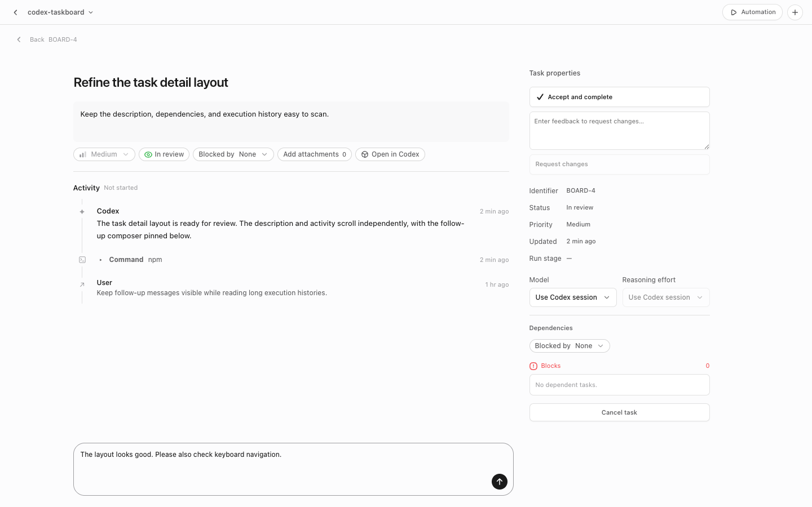

<div align="center">
  
  <h1>Codex Taskboard</h1>
  <p><strong>Put your tasks on a board and let Codex take it from there.</strong></p>
  <p>Local-first · Codex-embedded board · Task dependencies · Automatic scheduling · Human review</p>
  <p>
    
    
    <a href="LICENSE"></a>
  </p>
  <p><a href="README.md">English</a> · <a href="README.zh-CN.md">简体中文</a></p>
</div>

Codex Taskboard is a local task board that runs inside Codex: organize requirements, set prerequisites, and hand them to Codex for execution. The menu bar launcher starts the service and mounts the panel; tasks, execution history, and project settings are stored in a local SQLite database.

This is an independent community project with no affiliation with or endorsement by OpenAI.



> All screenshots show the English interface built from the current source, using isolated demo tasks. Available models depend on the response from Codex on your machine.

## Highlights

| Feature | How it works |
| --- | --- |
| Customizable board | Todo and In progress always stay visible; toggle In review, Done, and Canceled under Visible tabs, with Canceled on the far right; display preferences are saved locally |
| Task dependencies | Set prerequisite tasks; a task enters the execution flow after its blockers are cleared |
| Parallel scheduling | Opt ordinary tasks into parallel execution or configure dependent subtasks in a group; no concurrency cap |
| Automation toggles | Auto-claim is off by default, and human review is on by default |
| Usage-limit continuation | Automatic continuation after usage limits is enabled by default; you can disable it per project and manually resume the original thread |
| Execution options | Reuse the Codex session by default, or choose a model and reasoning effort for each task |
| Local integration | Sync projects and working directories from the Codex host and execute tasks through the App Server |

### Create a task with clear context

Enter a title, Markdown description, priority, and acceptance criteria. Use “More” to search and edit model, reasoning effort, worktree, branch, and scope settings without enlarging the composer. The same popover keeps its draft when closed; use “Save settings” in task details to submit changes.

Attach PNG, JPEG, GIF, WebP images, Markdown, plain text, PDF, or Office documents (up to 10 files, 10 MB each, 20 MB total). Files are saved with the task and provided to Codex through local paths during execution. Preview images and text in the details; open PDF and Office documents in their default external applications.

Choose the Draft priority to save unfinished ideas in Todo without automatic or manual execution. Change to another priority to publish; pause running tasks before turning them into drafts.



### Set dependencies to make execution order clear

Select prerequisite tasks under “Blocked by” to split work that must happen in sequence.



### View status and execution history in the details

Review task properties, execution stage, dependencies, and run history in one place. You can also hand a task to Codex manually or cancel it.

Ordinary tasks and subtasks that are running, in review, or completed have a pinned follow-up composer in the left detail panel. Messages steer an active turn or continue the same thread after completion. Enter sends; Shift+Enter adds a line; failed sends retain the draft. Long descriptions and history scroll independently. “Open in Codex” opens the native conversation; native follow-up messages, replies, and turn status sync back to the board.

Normal development and packaged launches share the desktop's existing App Server without synthetic native notifications or changes to its composer. Live events are backed by a latest-turn check every five seconds. Legacy task pause returns to draft; managed parallel tasks preserve their delivery state and require confirmed interruption before releasing reservations. Restart the launcher after upgrading to load these changes. Backend-only / no-injector diagnostic modes retain an isolated stdio server and do not provide native bidirectional sync.

Before starting or steering a task turn through the desktop connection, Taskboard registers the native browser route for that conversation so enabled in-app browser tools can run without first opening the native conversation. Codex continues to manage browser plugins, site permissions, and approvals. Isolated stdio diagnostic modes do not provide this desktop browser integration.



Ordinary exclusive tasks offer the current project directory or a new worktree. New worktrees use the Codex desktop's native creation, ownership, and cleanup services and require a desktop connection. Enter an existing local or remote starting branch (for example, `main` or `origin/main`), or leave it empty to copy the current working tree state. Codex manages the independent checkout from that starting point. Once execution starts, location and branch are locked; retries and follow-ups reuse the saved worktree and conversation. Task details show the actual worktree path. If creation times out or the connection drops, check Codex for a created worktree before retrying.

### Parallel execution and groups

Ordinary tasks default to exclusive execution. Choose “Allow parallel” before the first start to use an isolated native Codex worktree and conversation. All eligible tasks can run; there is no execution-count limit or setting. Projects backed by the same Git common directory share exclusivity and scope reservations. A ready exclusive task stops later parallel tasks from overtaking it while existing executions drain; unmet dependencies do not create a barrier.

Create a parallel group, then add subtasks in its details. Declare dependencies and optional write scopes, or generate an AI decomposition draft and edit it before confirming. Draft generation never changes the execution graph or starts implementation. Submit a group with at least one valid subtask; with auto-claim disabled, run the submitted group manually. One nesting level is supported. Subtasks depend on members of their own group; top-level cards express dependencies between groups. The parent has no implementation Agent.

Subtasks inherit the parent model and reasoning effort unless overridden. They start from the integration revision containing their completed dependencies. Failure blocks only dependent work. Each subtask integrates automatically; the complete group is reviewed and delivered once. “Confirm and merge” publishes the reviewed commit, or publication is automatic when human review is disabled. Only verified Git integration marks a managed delivery done.

Parallel executions start from committed revisions, defaulting to the local target branch selected at creation; “More” can select another existing starting branch. Uncommitted main-workspace changes are not copied. Saved baselines, worktrees, and target branches are fixed after first start. Merges run in isolated worktrees and serialize per repository. Git handles clean merges; only conflicts create a dedicated Codex repair session. Source, target, and result commits are recorded. A moving target causes preparation to restart; a dirty target requires attention and retry, without automatic stash, reset, or overwrite.

Write scopes are optional repository-relative files or directories, one per line, without globs. Reservations last until integration; groups reserve the union externally and check child overlap internally. These are coordination rules, not Shell write interception. Unscoped tasks may still conflict. Out-of-scope changes require pausing and explicitly expanding the scope before integration; changes are retained.

Pause stops dispatch before interrupting and confirming active implementation and auxiliary turns. Uncertain stops retain reservations. Paused groups can add work, remove unstarted tasks, or adjust unstarted dependencies. Reworking a dependency marks consumers for revalidation. Cancel preserves history and already integrated changes. Reconnection reconciles native turns, worktrees, and recorded operations without blindly replaying creation or execution. Details can link an existing worktree or conversation after uncertain creation. Conflicting turns launched directly in Codex are reported after synchronization; external activity cannot be intercepted in advance.

Existing tasks migrate as ordinary exclusive tasks, retaining their worktree, conversation, dependencies, and history. They are not retroactively auto-merged.

## Language

Taskboard follows Codex’s display language automatically: Simplified Chinese uses Chinese; every other language, including Traditional Chinese, uses English. The board, sidebar entry, and menu bar launcher update when Codex’s language changes. The launcher uses English until Codex reports its language.

Task titles, descriptions, attachments, and conversation content stay in their original language. Switching the interface language preserves open forms and follow-up drafts. Task execution prompts ask Codex to respond in the task author’s language.

## Requirements

- macOS 14 or later on Apple Silicon (arm64). Windows 11 x64 platform support and installer builds are implemented; Windows desktop acceptance testing is still pending. Linux, Intel Mac, and Windows ARM64 are unverified.
- An installed and signed-in Codex desktop app.
- For running from source: Python 3.13+, Node.js 22+, and npm.
- For building the App / DMG: Xcode Command Line Tools, Rust, and PyInstaller are also required; the Tauri CLI is included in the npm development dependencies.

## Quick start

```bash
git clone https://github.com/Aurxs/codex-taskboard.git
cd codex-taskboard
python3 -m venv .venv
source .venv/bin/activate
python -m pip install -e .
npm ci
python scripts/dev.py
```

After startup, click “Taskboard” in Codex’s sidebar. Select a project, create a task, hand it to Codex manually, or enable auto-claim in the automation settings. If you keep human review enabled, which is the default, confirm the result when execution finishes.

If the current Codex instance does not expose CDP, the launcher asks for confirmation, exits normally, and reopens the client with a dedicated profile. Keep the terminal running when using source development mode.

## Development

Python 3.13 and Node.js/npm are required. After installing the backend and frontend dependencies, run the unified development command:

```bash
python3 -m pip install -e .
npm install
python3 scripts/dev.py
```

This command starts Vite and a shared sidecar containing FastAPI and the CDP injector. Taskboard has no standalone work window: the launcher adds a “Taskboard” entry to the Codex sidebar, and clicking it shows the board in Codex’s main content area. The embedded iframe points to Vite `5173`, while `/api` is proxied to FastAPI `47823`. The sidecar uses the desktop's existing App Server through its message bridge. The development database is `.data/` in the repository.

UI translations live in `web/src/locales/en.ts`, keyed by the Chinese source text. Add interface messages through `t()` in `web/src/i18n.ts`; keep stored task values and user content independent of the display language.

After `npm run build`, run `node scripts/check_i18n.mjs` with an installed Playwright module (or set `PLAYWRIGHT_MODULE` to its path). The script mocks every request, verifies language switching and English fallback, and writes the four English README captures to `output/playwright/i18n/`. Copy the reviewed images to `docs/images/` to update this page.

Common options:

```bash
python3 scripts/dev.py --backend-only
python3 scripts/dev.py --no-injector
python3 -m injector.cdp_injector --port 9229 --no-launch
```

The injector automatically looks for an installed ChatGPT.app/Codex.app in `/Applications/` or `~/Applications`. If an existing Codex instance exposes loopback CDP, it connects directly. If a running standard Codex instance does not expose CDP, the menu bar launcher asks for confirmation, exits that instance normally, and reopens Codex with a separate profile and dedicated loopback port. This ensures that the Codex instance currently visible to the user is the injected one without silently leaving an old window that lacks the Taskboard panel. `CODEX_TASKBOARD_CODEX_APP`, `CODEX_TASKBOARD_CODEX_PROFILE`, and `CODEX_TASKBOARD_CDP_PORT` are development and debugging overrides; normal use requires no path or project key.

## Injection safety boundary

`injector/cdp_injector.py` reads only the CDP `/json/list` endpoint on `127.0.0.1` and verifies that the WebSocket remains bound to the same loopback port. `injector/inject.js` clones Codex’s native sidebar button, mounts the Taskboard page in Codex’s main content surface, and observes renderer rebuilds so it can mount the page again. The project name, project id, actual working directory, and current selection come from Codex’s read-only renderer host context and are idempotently synced to the local database; no manual project creation is required. The injector does not modify `app.asar`, Codex data files, React modules, or global `fetch`, and it does not inject hidden context into Codex turns.

By default, the injector requests a renderer-scoped CDP CSP bypass so the loopback iframe can load under Codex’s CSP. Use `--no-csp-bypass` when it is unnecessary. This setting is not written to Codex files and applies only to the current CDP renderer.

## Windows development and installer

Install Python 3.13+ x64, Node.js 22+, Git, Rust MSVC, and the C++ Build Tools. In PowerShell:

```powershell
py -3.13 -m venv .venv
.\.venv\Scripts\python.exe -m pip install -e . pyinstaller httpx ruff
npm ci
.\.venv\Scripts\python.exe scripts/dev.py
# Build an NSIS installer into output/
.\.venv\Scripts\python.exe scripts/build_windows.py
```

On Windows the icon lives in the taskbar notification area. Menus, UI, scheduling, and the desktop bridge are shared with macOS; native APIs are isolated in platform modules. Data is stored in `%APPDATA%\com.codex.taskboard`. Windows CI builds the installer and runs a frozen-sidecar smoke without connecting to Codex. Actual Windows Codex integration still needs desktop acceptance testing; see the [Windows guide and verification status (Chinese)](docs/windows.zh-CN.md).

## Building the macOS App and DMG

Packaging also requires Rust, the Tauri CLI, PyInstaller, and Apple Silicon macOS. Install the project dependencies first, then run:

```bash
python -m pip install pyinstaller
bash scripts/build_macos.sh
```

After a successful build and sidecar smoke check, the latest DMG is moved to the repository's `output/` directory (ignored by Git). Older DMGs in `output/` and the Tauri DMG staging directory are removed. The `.app` remains under `src-tauri/target/aarch64-apple-darwin/release/bundle/macos/`.

`scripts/build_macos.sh` first runs `npm run build:web`. `build_sidecar.py` then verifies `dist/web/index.html` and packages the entire `dist/web` directory and `src/codex_taskboard` into the PyInstaller sidecar before running the Tauri build. Without a configured Developer ID, the script uses a full local ad-hoc signature; the artifact is suitable for local testing but has not been notarized by Apple. In the packaged sidecar, PyInstaller’s `_MEIPASS/dist/web` is assigned to `CODEX_TASKBOARD_STATIC_DIR` before FastAPI is imported, so the iframe still points to loopback FastAPI `47823` and no separate static file server is needed. Development runs also detect `dist/web` at the repository root automatically; set `CODEX_TASKBOARD_STATIC_DIR` to override it.

The Tauri configuration is in `src-tauri/tauri.conf.json`, and shell permissions are in `src-tauri/capabilities/default.json`. On macOS, the launcher only displays a menu bar icon; `LSUIElement` and `ActivationPolicy::Accessory` keep it out of the Dock and prevent it from creating a standalone Taskboard window. The menu can show injection status, open Taskboard in Codex, restart the service, open the startup log, or quit. Open and stop commands are sent to the frozen sidecar through a local control mailbox in the application support directory; quitting Taskboard does not also close the user’s Codex window. If Rust, the Tauri CLI, or PyInstaller is missing, the script fails clearly instead of claiming that an `.app` or DMG was generated.

The build script ends with a sidecar smoke check. Developers can also run these checks manually:

```bash
python3 scripts/check_packaging.py
python3 scripts/check_sidecar_smoke.py --required
```

`check_sidecar_smoke.py` starts the frozen sidecar on a random loopback port, verifies `/health`, and then uses the same control mailbox to check exit cleanup. Final confirmation of Codex restart behavior, sidebar appearance, renderer-rebuild injection, and data retention after uninstall still requires hands-on validation in a graphical Apple Silicon macOS session.

## Data and privacy

- Desktop data is stored by default in `~/Library/Application Support/Codex Taskboard/`; source development uses `.data/` in the repository.
- The local database, logs, browser profiles, and build artifacts are not uploaded to this repository.
- Tasks are executed by the Codex App Server. “Local-first” means the board service and data are stored on the local machine; it does not mean the model runs offline.
- Deployment installs three explicit-only Taskboard skills in the user’s global Codex skills directory. Taskboard messages invoke the relevant skill; ordinary Codex conversations do not load these rules automatically. Taskboard does not use Scheduled Tasks or override system/developer instructions, sandbox, or approval settings.

## Taskboard skills

Taskboard keeps its workflow instructions in three short skills: `codex-taskboard-execute` (task execution, follow-ups and retries), `codex-taskboard-plan` (JSON decomposition proposals), and `codex-taskboard-merge` (integration conflicts). Each has `policy.allow_implicit_invocation: false`.

Desktop deployment installs/updates them on first launch and after upgrades, before connecting to Codex. `scripts/dev.py` and the `codex-taskboard` entry point also perform this idempotent setup. Files live in `$CODEX_HOME/skills`, or `~/.codex/skills` by default. For a direct Uvicorn deployment, install them first:

```bash
python -m codex_taskboard.task_skills
```

Installation updates only the files belonging to Taskboard-managed skills and refuses to overwrite an existing unowned skill with the same name. Keep personal skills under separate names; managed files are restored on the next deployment startup. Installation failures stop startup and are reported in the startup log. Sending tasks only references installed files; it does not install skills or change global Codex configuration.

Every Taskboard turn explicitly references the relevant `$codex-taskboard-*` skill and its absolute path using the [App Server skill input](https://developers.openai.com/codex/app-server). Skills are included in both Python packages and the desktop sidecar.

## Architecture

`src/codex_taskboard` handles SQLite, FastAPI, SSE, scheduling, and the Codex protocol client. `web` is the React/Vite board that provides full functionality only when embedded in Codex. `injector` provides the CDP controller, passive native-message reader, and board host bridge. `src-tauri` is a windowless launcher that manages the Python sidecar lifecycle; the board is always shown inside Codex.

All public APIs are served on local loopback. State writes use optimistic locking through version fields. `Interaction` and `blocking_scope` are reserved for future asynchronous interactions, but v1 does not enable Astra-specific scheduling or add model branches.

## Sources and license

This project is licensed under Apache-2.0. The board visuals, Codex CDP injection, and desktop packaging approach were informed by [chuspeeism/dashi-taskboard](https://github.com/chuspeeism/dashi-taskboard); see [NOTICE](NOTICE) for details.

The app icon reuses icon resources from the local Codex client. Related artwork and trademark rights belong to OpenAI and are not included in this project’s Apache-2.0 code license.
