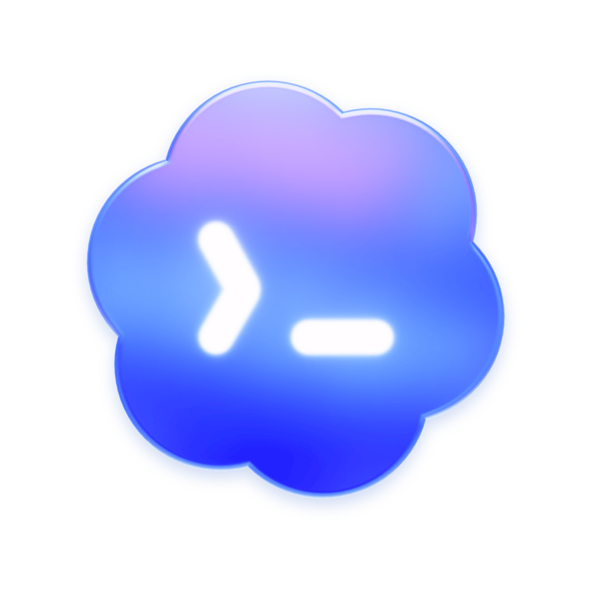
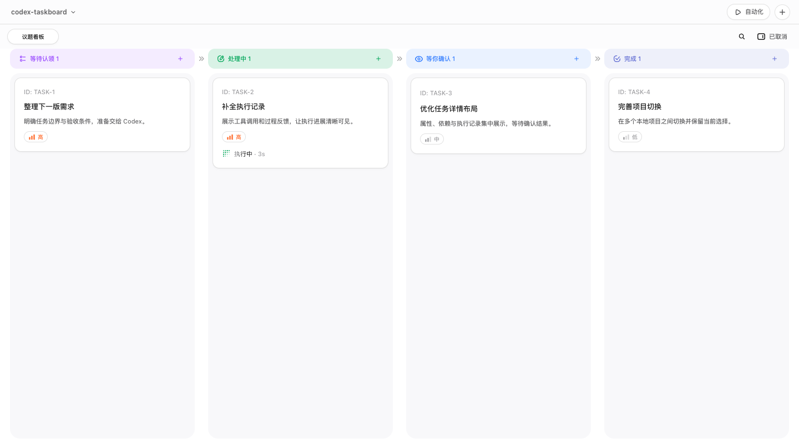
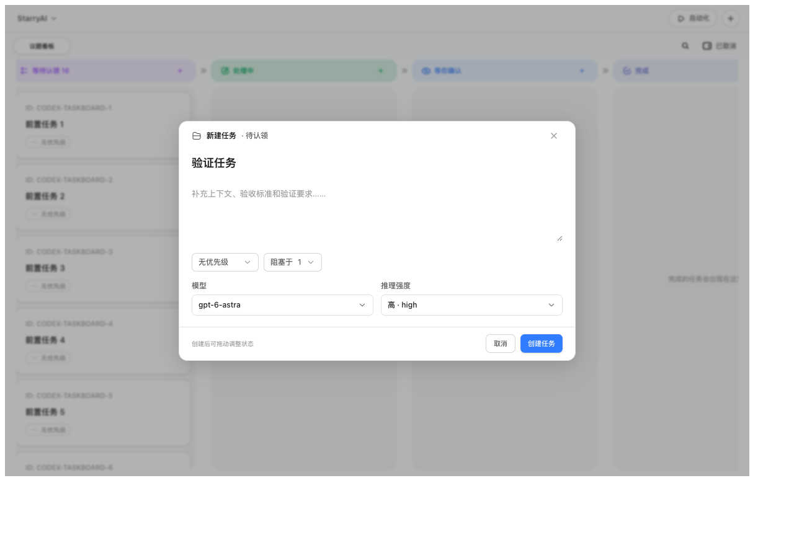
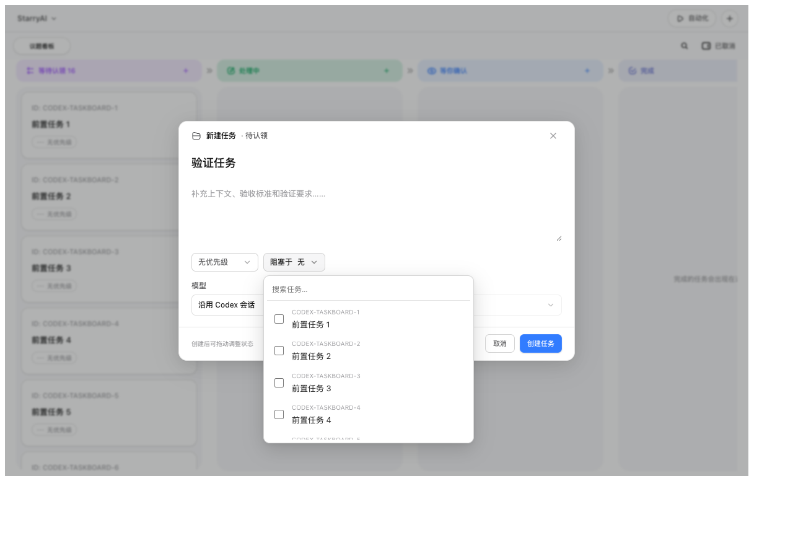
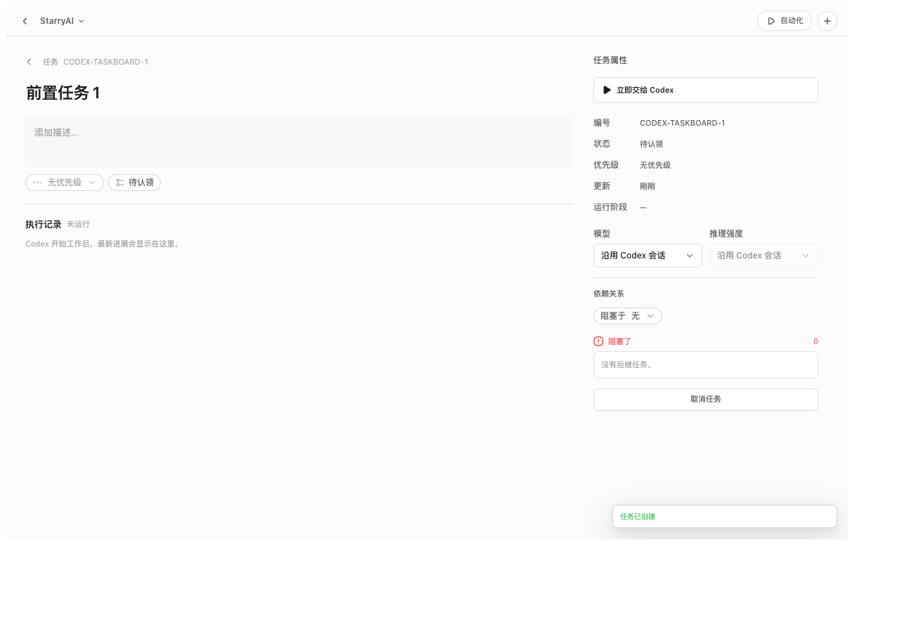

<div align="center">
  
  <h1>Codex Taskboard</h1>
  <p><strong>把任务排进看板，让 Codex 接着做。</strong></p>
  <p>本地优先 · Codex 内嵌看板 · 任务依赖 · 自动调度 · 人工确认</p>
  <p>
    
    
    <a href="LICENSE"></a>
  </p>
  <p><a href="README.md">English</a> · <a href="README.zh-CN.md">简体中文</a></p>
</div>

Codex Taskboard 是一个运行在 Codex 内部的本地任务看板：整理需求、设置前置依赖，再交给 Codex 执行。菜单栏启动器负责启动服务和挂载面板，任务、执行记录与项目设置保存在本机 SQLite 数据库中。

这是一个独立社区项目，与 OpenAI 无隶属或背书关系。



> 首图为当前版本重新截取的四列看板，其余图片展示任务创建和详情布局；示例任务及模型选项不代表运行时数据，可用模型以本机 Codex 返回结果为准。

## 功能亮点

| 功能 | 使用方式 |
| --- | --- |
| 四列看板 | 等待认领 → 处理中 → 等你确认 → 完成；取消任务可单独查看 |
| 任务依赖 | 指定前置任务，阻塞解除后再进入执行流程 |
| 项目调度 | 同一项目最多运行一个任务，不同项目可并行 |
| 自动化开关 | 自动认领默认关闭，人工审阅默认开启 |
| 额度续跑 | 默认开启额度自动续跑，也可按项目关闭并手动恢复原 thread |
| 执行选项 | 默认沿用 Codex 会话，也可为任务选择模型和推理强度 |
| 本地集成 | 从 Codex 宿主同步项目和工作目录，使用 App Server 执行任务 |

### 创建任务，把上下文交代清楚

填写标题、Markdown 描述、优先级和验收要求；需要时选择模型与推理强度，下次执行生效。

创建时可附加 PNG、JPEG、GIF、WebP 图片及 Markdown 文档，支持移除待上传文件；最多 10 个附件，单个最多 10 MB、合计最多 20 MB。附件随任务保存，在详情中下载，执行时通过本地文件路径提供给 Codex。

尚未构思完成的任务可选择「草稿」优先级。草稿保存在待认领列表，不会自动认领或直接运行；将优先级改为其他等级后即可发布。「暂停并退回草稿」会中断当前回合并保留原会话，暂停后不会被自动认领。



### 设置依赖，让执行顺序更清晰

在「阻塞于」中选择前置任务，拆分有先后关系的工作。



### 在详情中查看状态与执行记录

集中查看任务属性、执行阶段、依赖关系和运行记录，也可以手动交给 Codex 或取消任务。

执行中、等你确认和已完成的任务，详情左侧底部都有固定的跟进输入框。执行中发送的文字会补充到当前回合，结束后会继续原会话；Enter 发送，Shift+Enter 换行，发送失败保留输入。长描述编辑和执行记录可以独立滚动。点击「在 Codex 中打开」可进入原生对话，在 Codex 中发送的用户消息、后续回复和状态也会同步回来。

常规启动与开发模式共用 Codex 桌面已有的会话服务，不伪造原生通知、不修改原生输入框或会话界面。实时事件同步之外，每 5 秒核对最新回合，弥补重连时遗漏的事件。升级后需重新启动启动器以加载新代码；`--backend-only` / `--no-injector` 诊断模式仍使用独立 stdio 服务，不提供原生双向同步。



## 系统要求

- macOS 14 或更高版本，Apple Silicon（arm64）；当前不提供 Windows、Linux 或 Intel Mac 支持。
- 已安装并登录的 Codex 桌面客户端。
- 从源码运行：Python 3.13+、Node.js 22+ 和 npm。
- 构建 App / DMG：额外需要 Xcode Command Line Tools、Rust 与 PyInstaller；Tauri CLI 已列入 npm 开发依赖。

## 快速开始

```bash
git clone https://github.com/Aurxs/codex-taskboard.git
cd codex-taskboard
python3 -m venv .venv
source .venv/bin/activate
python -m pip install -e .
npm ci
python scripts/dev.py
```

启动后，在 Codex 左侧栏点击「任务面板」。选择项目后创建任务，手动交给 Codex，或在自动化设置中启用自动认领。保留默认人工审阅时，执行结束后由你确认结果。

如果当前 Codex 没有开放 CDP，启动器会先请求确认，再正常退出并以专用 profile 重新打开客户端。启动源码开发模式时，请保持终端运行。

## 开发

需要 Python 3.13、Node.js/npm；安装前后端依赖后，运行统一开发命令：

```bash
python3 -m pip install -e .
npm install
python3 scripts/dev.py
```

该命令会在 loopback 上启动 Vite 和共享 sidecar（FastAPI＋CDP 注入器）。Taskboard 不提供独立工作窗口：启动器会在 Codex 侧边栏加入“任务面板”入口，点击后在 Codex 主内容区显示看板。嵌入 iframe 指向 Vite `5173`，`/api` 再由 Vite proxy 到 FastAPI `47823`；sidecar 通过桌面现有消息通道使用同一个 Codex App Server，不另起会话服务。开发数据库为仓库内 `.data/`。

常用选项：

```bash
python3 scripts/dev.py --backend-only
python3 scripts/dev.py --no-injector
python3 -m injector.cdp_injector --port 9229 --no-launch
```

注入器会自动查找 `/Applications` 或 `~/Applications` 中已经安装的 ChatGPT.app/Codex.app。若现有 Codex 已开放 loopback CDP，会直接连接；若正在运行的普通 Codex 没有开放 CDP，菜单栏启动器会先提示用户确认，正常退出该实例，再以独立 profile 和专用 loopback 端口重新打开 Codex。这样用户当前看到的 Codex 就是被注入的实例，不会静默留下一个没有任务面板的旧窗口。`CODEX_TASKBOARD_CODEX_APP`、`CODEX_TASKBOARD_CODEX_PROFILE` 和 `CODEX_TASKBOARD_CDP_PORT` 仅作为开发调试覆盖项，正常使用无需填写路径或项目 key。

## 注入安全边界

`injector/cdp_injector.py` 只读取 `127.0.0.1` 的 CDP `/json/list`，并验证 WebSocket 仍然绑定到同一 loopback 端口。`injector/inject.js` 克隆 Codex 原生侧栏按钮，把 Taskboard page 挂载到 Codex 的主内容 surface，并观察 renderer 重建后重新挂载。项目名称、项目 id、真实工作目录和当前选择由 Codex renderer 的只读 host context 提供，再幂等同步到本地数据库；用户无需手工创建项目。注入器不会修改 `app.asar`、Codex 数据文件、React 模块或全局 `fetch`，也不会向 Codex turn 注入隐藏上下文。

默认会请求 renderer 范围的 CDP CSP bypass，以便 loopback iframe 在 Codex 的 CSP 下加载；不需要时可以使用 `--no-csp-bypass`。该设置不写入 Codex 文件，且只作用于当前 CDP renderer。

## 构建 macOS App 与 DMG

打包还需要 Rust、Tauri CLI、PyInstaller 和 Apple Silicon macOS。先安装项目依赖，再执行：

```bash
python -m pip install pyinstaller
bash scripts/build_macos.sh
```

打包及 sidecar smoke 检查成功后，最新 DMG 会移动到项目根目录的 `output/`（已由 Git 忽略），并清理 `output/` 和 Tauri DMG 暂存目录中的旧版 DMG。`.app` 仍位于 `src-tauri/target/aarch64-apple-darwin/release/bundle/macos/`。

`scripts/build_macos.sh` 会先运行 `npm run build:web`，再由 `build_sidecar.py` 校验 `dist/web/index.html` 并把整个 `dist/web` 与 `src/codex_taskboard` 收进 PyInstaller sidecar，最后执行 Tauri build。没有配置 Developer ID 时，脚本会使用完整的本地 ad-hoc 签名；该产物可用于本机测试，但没有经过 Apple 公证。打包态 sidecar 会在导入 FastAPI 前将 PyInstaller 的 `_MEIPASS/dist/web` 设置为 `CODEX_TASKBOARD_STATIC_DIR`，因此 iframe 仍然指向 loopback 的 FastAPI `47823`，不需要额外的静态文件服务器。开发运行时也会自动探测仓库根目录的 `dist/web`；如需覆盖可直接设置 `CODEX_TASKBOARD_STATIC_DIR`。

Tauri 配置在 `src-tauri/tauri.conf.json`，shell 权限在 `src-tauri/capabilities/default.json`。启动器只显示 macOS 菜单栏图标，`LSUIElement` 与 `ActivationPolicy::Accessory` 共同确保它不常驻 Dock，也不会创建独立任务面板窗口。菜单可查看注入状态、在 Codex 中打开任务面板、重启服务、打开启动日志或退出。打开和停止命令通过应用支持目录中的本地 control mailbox 发送给 frozen sidecar；退出 Taskboard 不会顺带关闭用户的 Codex 窗口。未安装 Rust、Tauri CLI 或 PyInstaller 时，脚本会明确失败，不会声称已经生成 `.app`/DMG。

构建脚本最后会执行 sidecar 冒烟检查。开发者也可按需手动运行以下检查：

```bash
python3 scripts/check_packaging.py
python3 scripts/check_sidecar_smoke.py --required
```

`check_sidecar_smoke.py` 会用随机 loopback 端口启动冻结后的 sidecar，验证 `/health`，再通过同一 control mailbox 检查退出清理。最终的 Codex 重启确认、侧栏视觉效果、renderer 重建注入和卸载后数据保留仍需在 Apple Silicon macOS 图形会话中实机验证。

## 数据与隐私

- 桌面版数据默认位于 `~/Library/Application Support/Codex Taskboard/`；源码开发模式使用仓库内 `.data/`。
- 本地数据库、日志、浏览器 profile 和构建产物不上传到本仓库。
- 任务由 Codex App Server 执行；「本地优先」指看板服务和数据存储在本机，并不意味着模型离线运行。
- 不安装 Taskboard Skill、不使用 Scheduled Tasks，不覆盖 Codex 的 system/developer 指令、沙箱或审批设置。

## 架构

`src/codex_taskboard` 负责 SQLite schema/migrations、FastAPI API、SSE、调度器和 Codex 会话协议客户端。`web` 是只在 Codex 内嵌态提供完整功能的 React/Vite 看板。`injector` 提供 Python CDP 控制器、被动原生消息读取和看板宿主桥。`src-tauri` 是无窗口启动器，只管理 Python sidecar 生命周期；看板始终显示在 Codex 内部。

所有公开 API 都在本地 loopback 上提供；状态写入使用版本字段进行乐观锁检查。`Interaction` 与 `blocking_scope` 为未来异步交互保留接口，但 v1 不启用 Astra 专属调度，不增加模型分支。

## 来源与许可

本项目保留 Apache-2.0 许可。看板视觉、Codex CDP 注入和桌面打包的实现思路参考了 [chuspeeism/dashi-taskboard](https://github.com/chuspeeism/dashi-taskboard)，详见 [NOTICE](NOTICE)。

应用图标复用本机 Codex 客户端的图标资源，相关图形与商标权利属于 OpenAI，不包含在本项目 Apache-2.0 代码许可授权中。
